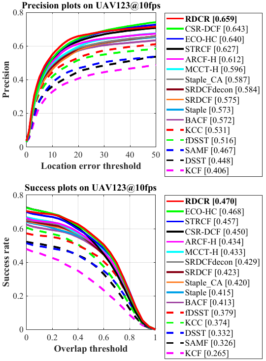

# Response Deviation and Channel Reliability Aware Correlation Filters for Real-Time UAV Tracking

Matlab implementation of our Response Deviation and Channel Reliability Aware Correlation Filters for Real-Time UAV Tracking (RDCR).

| **Test passed**                                              |
| ------------------------------------------------------------ |
|  |

# Abstract 
>Discriminative correlation filter (DCF) based approaches have shown impressive performance in UAV tracking, thus promise more related applications. However, the standard DCFs update the filters with the current training samples, which is prone to drift in the face of object appearance variations. Besides, not all features in channels benefit to identify the object, while most DCFs give all channels the same weight. In view of these drawbacks, this work presents two effective regularizations: (i) A novel temporal regularizer utilizing the response deviation. By regularizing the second-order difference of the responses, the tracker can smooth the deviations of the responses and better adapt to the change of the appearance model. (ii) A novel channel reliability aware regularizer which enables the tracker to pay more attention to reliable channels and result in discriminability enhancement. Integrating aforementioned response deviation and channel reliability aware regularizations, this work proposes an original tracking approach, i.e., RDCR tracker. Comprehensive evaluations on multiple well-known benchmarks specific for UAV object tracking validate the robustness and accuracy of the proposed RDCR tracker against other 28 state-of-the-art trackers. With a real-time speed of $\sim$44 frames/s on a single CPU, the proposed tracker shows competitive performance.

# Contact 
Junjie Ye

Email: ye.jun.jie@tongji.edu.cn

Changhong Fu

Email: changhongfu@tongji.edu.cn

# Demonstration running instructions

>Running demonstration of this tracker is very easy so long as you have MATLAB. Just download the package, extract it and follow two steps:
>
>1. Config seq name in `configSeqs_demo_for_RDCR.m`,
>
>2. Run `RDCR_Demo_single_seq.m`,
>     and the RDCR Demo should be running.

# Results on UAV datasets

### UAV123@10fps

### DTB70

### UAVDT

# Acknowledgements

We thank the contribution of `Hamed Kiani`, `Feng Li`, Dr. `Martin Danelljan` for their previous work BACF, STRCF and ECO. The feature extraction modules are borrowed from the ECO tracker (https://github.com/martin-danelljan/ECO) and STRCF tracker (https://github.com/lifeng9472/STRCF) and some of the parameter settings and functions are borrowed from BACF (www.hamedkiani.com/bacf.html) and STRCF.

