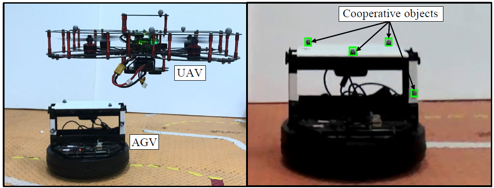
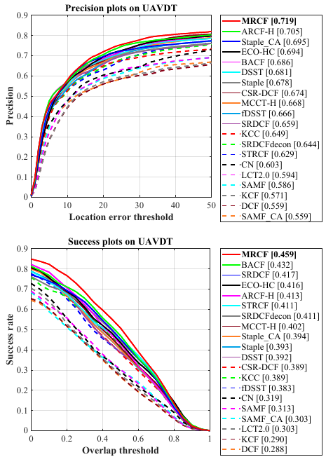
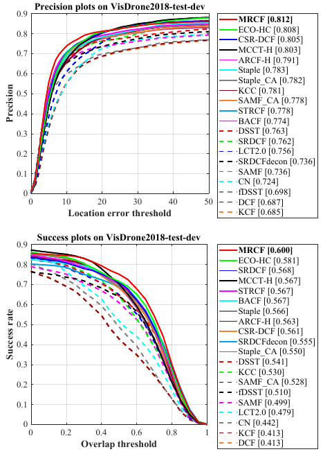
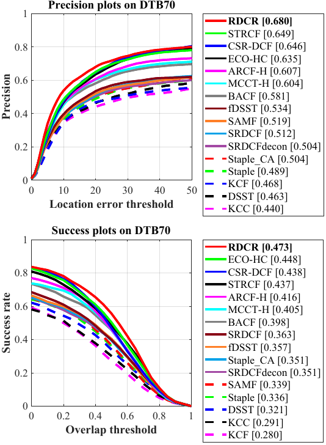
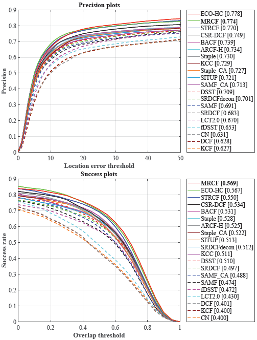

# Multi-Regularized Correlation Filter for UAV Tracking and Self-Localization

Matlab implementation of our Multi-Regularized Correlation Filter (MRCF).

| **Test passed**                                              |
| ------------------------------------------------------------ |
|  |

# Abstract 
>As a sort of model-free tracking approach, discriminative correlation filter (DCF)-based trackers have shown prominent performance in unmanned aerial vehicle (UAV) tracking. Nevertheless, typical DCFs acquire all samples oriented to filter training merely from the current frame by cyclic shift operation in the spatial domain but ignore the consistency between samples across the timeline. The lack of temporal cues restricts the performance of DCFs under object appearance variations arising from object/UAV motion, scale variations, and viewpoint changes. Besides, many existing methods commonly neglect the channel discrepancy in object position estimation and generally treat all channels equally, thus limiting the further promotion of the tracking discriminability. To these concerns, this work proposes a novel tracking approach based on a multi-regularized correlation filter, i.e., MRCF tracker. By regularizing the deviation of responses and the reliability of channels, the tracker enables smooth response variations and adaptive channel weight distributions simultaneously, leading to favorable adaption to object appearance variations and enhancement of discriminability. Exhaustive experiments on five authoritative UAV-specific benchmarks validate the competitiveness and efficiency of MRCF against top-ranked trackers. Furthermore, we apply our proposed tracker to monocular UAV self-localization under air-ground robot coordination. Evaluations indicate the practicability of the presented method in UAV localization applications.

# Reference

> @ARTICLE{Ye_2021_TIE,
>   author={J. {Ye} and C. {Fu} and F. {Lin} and F. {Ding} and S. {An} and G. {Lu}},
>   journal={IEEE Transactions on Industrial Electronics}, 
>   title={{Multi-Regularized Correlation Filter for UAV Tracking and Self-Localization}}, 
>   year={2021},
>   volume={},
>   number={},
>   pages={1-10},
>   }

# Contact 
Junjie Ye

Email: ye.jun.jie@tongji.edu.cn

Changhong Fu

Email: changhongfu@tongji.edu.cn

# Demonstration running instructions

>Running demonstration of this tracker is very easy so long as you have MATLAB. Just download the package, extract it and follow two steps:
>
>1. Config seq name in `configSeqs_demo_for_MRCF.m`,
>
>2. Run `MRCF_Demo_single_seq.m`,
>     and the MRCF Demo should be running.

# Results on UAV datasets

### UAVDT

### UAV123@10fps

### VisDrone2018-test-dev

### DTB70

### VisDrone2020-SOT

# Acknowledgements

We thank the contribution of `Hamed Kiani`, `Feng Li`, `Martin Danelljan` for their previous work BACF, STRCF and ECO. The feature extraction modules are borrowed from the ECO tracker (https://github.com/martin-danelljan/ECO) and STRCF tracker (https://github.com/lifeng9472/STRCF) and some of the parameter settings and functions are borrowed from BACF (www.hamedkiani.com/bacf.html) and STRCF.

